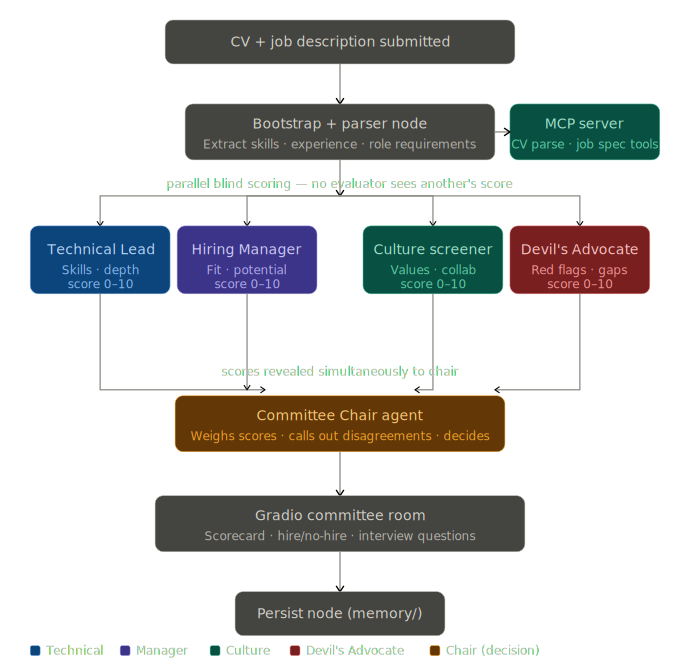

# AI Hiring Committee

## What This Agent Does

This project implements a **blind multi-evaluator hiring committee** built on **LangGraph + MCP + Ollama**. Paste or upload a CV and job description. Four committee members evaluate the candidate in parallel — completely blind to each other's scores. Their verdicts are revealed simultaneously to a Committee Chair, who calls out agreements, disagreements, and red flags before making the final hire/no-hire call.

- a **Technical Lead** evaluates skills depth, technical fit, and engineering quality
- a **Hiring Manager** evaluates delivery track record, ownership, and role fit
- a **Culture Screener** reads for collaboration signals, communication quality, and learning mindset
- a **Devil's Advocate** actively hunts for red flags, gaps, and reasons NOT to hire — with an inverted score where high means more concerns
- a **Committee Chair** sees all four scores simultaneously, weights them, calls out where the committee agrees and disagrees, and delivers a structured final decision

The blind scoring is the architectural core: no evaluator influences another. The reveal moment — four independent verdicts on the same CV — is what makes the output genuinely surprising and useful.

---

## Why This Is A Strong Visitor-Facing Agent

- everyone has been through a hiring process — the output is immediately legible and personal
- the blind scoring reveal is dramatic: four people saw the same CV and reached different conclusions
- the Devil's Advocate makes the output honest in a way a single LLM never would be
- the scorecard dashboard is immediately actionable — real interviewers would find these questions useful
- the CV upload (PDF/DOCX/TXT) makes it practical to use with real documents, not just demos
- the weighted scoring formula is transparent — users can see exactly how the decision was reached
- session persistence means every evaluation is saved and reloadable instantly

---

## Architecture Pattern

This agent uses a **Parallel Blind Evaluation + Chair Aggregation Architecture**.



```text
CV + Job Description
        |
        v
┌─────────────────────────────────┐
│ Bootstrap + Parser node         │  Extracts skills, experience, requirements
│                                 │  via MCP tools (CV parser, spec extractor)
└────────────────┬────────────────┘
                 │
     ┌───────────┼───────────┬───────────┐
     │           │           │           │
     v           v           v           v
┌─────────┐ ┌─────────┐ ┌─────────┐ ┌─────────────┐
│Technical│ │ Hiring  │ │ Culture │ │  Devil's    │
│  Lead   │ │ Manager │ │Screener │ │  Advocate   │
│ 0-10    │ │ 0-10    │ │ 0-10    │ │ 0-10 (inv.) │
└────┬────┘ └────┬────┘ └────┬────┘ └──────┬──────┘
     │           │           │              │
     └───────────┴───────────┴──────────────┘
                             │
                 ┌───────────v───────────┐
                 │   Committee Chair     │
                 │  Weighs all 4 scores  │
                 │  Calls out conflicts  │
                 │  Delivers decision    │
                 └───────────┬───────────┘
                             │
                    ┌────────v────────┐
                    │  Persist node   │  Saves full session to memory/
                    └────────┬────────┘
                             │
                    Gradio committee room
```

### Why blind scoring matters

If evaluators could see each other's scores, anchoring bias would collapse the output toward the first opinion. Each evaluator receives only the parsed CV, job spec, and requirements — nothing else. The Chair is the only agent that sees all four verdicts, and only after all four have completed. This mirrors how real hiring committees should work.

### The Devil's Advocate score is inverted

A Devil's Advocate score of 9/10 means 9 serious red flags found — not 9/10 quality. The Chair inverts this before weighting: `adjusted = 10 - advocate_score`. A clean candidate actually benefits from the advocate evaluation. A candidate with many red flags gets pulled down even if the other three loved them.

### Weighted scoring formula

```
overall = technical × 0.35 + manager × 0.25 + culture × 0.20 + (10 - advocate) × 0.20
```

---

## What The Visitor Actually Experiences

1. Upload a CV as PDF, DOCX, or TXT — or paste raw text directly.
2. Paste the job description. Set the role title.
3. Click **Convene the committee**.
4. Four evaluators run in parallel. The UI reveals:
   - A **decision banner** — STRONG HIRE / HIRE / NO HIRE / STRONG NO HIRE with the weighted score
   - The **chair's reasoning** — why this decision, what tipped it
   - **Where the committee agreed** — things all evaluators noticed
   - **Where the committee disagreed** — the most interesting part
   - **Red flags** — the advocate's most serious concerns
   - **Top 3 interview questions** — consolidated from all four evaluators
   - **Four individual scorecards** — each evaluator's score, verdict, strengths, concerns, and the specific questions they would ask
5. The session is saved. Any previous session loads instantly from the archive.

---

## Key Features

| Feature | Description |
|---|---|
| **Parallel blind scoring** | All 4 evaluators run simultaneously with no cross-visibility — true blind evaluation |
| **CV upload** | Upload PDF, DOCX, or TXT — text extracted automatically and shown in the CV field |
| **Inverted Devil's Advocate** | High advocate score = more red flags; score is inverted before weighting |
| **Weighted decision formula** | Technical 35% · Manager 25% · Culture 20% · Advocate 20% (inverted) |
| **Chair disagreement detection** | Chair explicitly calls out where evaluators diverged, not just averages |
| **Per-evaluator interview questions** | Each evaluator generates questions specific to their concerns |
| **Screening Summary export** | Generate a one-page screening doc ready to send to the hiring team |
| **Candidate comparison** | Compare two candidates evaluated for the same role side by side |
| **Session persistence** | Full session saved to `memory/<session_id>.json` — loads without re-running |
| **MCP server** | CV parsing, job spec extraction, session storage — all exposed as MCP tools |

---

## Extensions

### Screening Summary Generator

After evaluation, click **Generate screening summary** to produce a formatted one-page document covering: candidate overview, decision, key strengths, key concerns, recommended interview questions, and suggested panel composition. Ready to paste into a Notion doc or email to the hiring team.

### Candidate Comparison

Evaluate two candidates for the same role, then click **Compare candidates** to see a side-by-side breakdown: who scored higher on each dimension, where one candidate's weakness is the other's strength, and which candidate the committee would recommend for first-round interview.

---

## File Structure

```
AI Hiring Committee/
├── app.py                       # Gradio committee room UI (PDF upload + comparison)
├── graph.py                     # LangGraph parallel blind evaluation graph
├── mcp_server.py                # MCP tools: CV parse, spec extract, session storage
├── state.py                     # CommitteeState TypedDict + EvaluatorResult
├── config.py                    # Weights, thresholds, env config
├── agents/
│   ├── technical_agent.py       # Technical Lead — skills and depth
│   ├── manager_agent.py         # Hiring Manager — delivery and ownership
│   ├── culture_agent.py         # Culture Screener — values and collaboration
│   ├── advocate_agent.py        # Devil's Advocate — red flags (inverted score)
│   └── chair_agent.py           # Committee Chair — weighted synthesis + decision
└── memory/                      # Persisted session JSON files
```

---

## Setup

```env
OLLAMA_BASE_URL=http://localhost:11434/v1
OLLAMA_MODEL=qwen3:8b
COMMITTEE_TEMPERATURE=0.4
```

```bash
ollama pull qwen3:8b
pip install gradio langgraph langchain-openai mcp python-dotenv pypdf python-docx
python app.py
```

Opens at `http://localhost:7864`

---

## Example CVs To Try

**Strong candidate — expect STRONG HIRE:**
A Staff Engineer at Stripe/Airbnb with measurable impact, team leadership, and clear technical depth applying for a Staff Infrastructure role.

**Mixed candidate — expect committee disagreement:**
A self-taught engineer with impressive side projects but no formal team experience, applying for a Senior role that requires cross-functional leadership.

**Weak fit — expect NO HIRE:**
A mid-level frontend engineer with 3 years experience applying for a Principal Backend role requiring distributed systems expertise and 10+ years.

These three scenarios produce very different committee dynamics — especially in where the Devil's Advocate fires and where the evaluators disagree.

## Gradio UI


