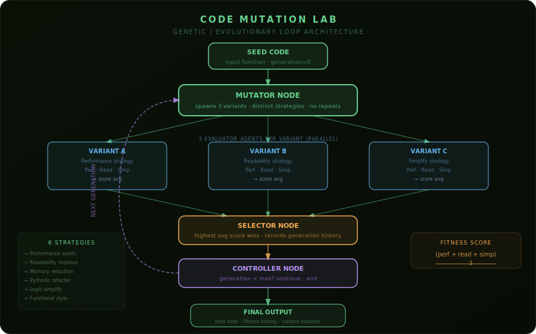

# Code Mutation Lab

## What This Agent Does

This project implements an **evolutionary code improvement engine** built on **LangGraph + Ollama**. You paste any Python function or script, choose how many generations to run, and the lab evolves it autonomously — mutating, competing, and selecting the fittest variant each round.

In plain language, this is a **genetic algorithm applied to code quality**. It is not a single rewrite prompt. The system runs a closed loop where:

- a **Mutator Agent** spawns 3 competing variants of the current code, each using a different named mutation strategy
- 3 **Evaluator Agents** judge each variant independently across performance, readability, and simplicity
- a **Selector Agent** picks the highest-scoring variant as the seed for the next generation
- a **Controller** decides whether to run another generation or terminate

The result is a full evolutionary history — every variant from every generation, every score, every strategy, and the fitness trajectory across all rounds.

Example inputs:

- `A nested loop duplicate-finder that should be O(n)`
- `A word counter with poor naming and redundant logic`
- `A recursive function that can be flattened`
- `Any function you want to see survive natural selection`

---

## Why This Is A Strong Visitor-Facing Agent

This one works because it makes the AI reasoning **visible and competitive**:

- the user sees 3 variants fighting for survival every generation — not just one rewrite
- each variant is labeled with the strategy used, so the approach is never hidden
- the fitness score changes across generations, so improvement (or regression) is measurable
- the full variant history is browsable, not just the final answer
- the architecture is genuinely different from a rewrite chatbot — it is a loop with selection pressure

---

## Architecture Pattern

This agent uses a **Genetic / Evolutionary Loop Architecture**.



```text
User submits seed code
        |
        v
┌──────────────────────────────┐
│ Mutator Node                 │  spawns 3 variants using distinct strategies
│                              │  (performance, readability, memory, etc.)
└──────────────┬───────────────┘
               |
               v
┌──────────────────────────────┐
│ Evaluator Node               │  runs 3 sub-agents per variant in sequence:
│  ├── Performance Agent       │    scores time complexity and efficiency
│  ├── Readability Agent       │    scores clarity, naming, structure
│  └── Simplicity Agent        │    scores logic density and cleanliness
└──────────────┬───────────────┘
               |
               v
┌──────────────────────────────┐
│ Selector Node                │  picks the highest average-scoring variant
│                              │  records the full generation to history
└──────────────┬───────────────┘
               |
               v
┌──────────────────────────────┐
│ Controller Node              │  checks generation count vs max_generations
│                              │  routes: continue → Mutator  or  end → output
└──────────────────────────────┘
               |
          ┌────┴────┐
       continue    end
          |          |
          ▼          ▼
       Mutator    Final output
     (next gen)   (best code +
                  full history)
```

This is fundamentally different from the other agents in this repo. There is no planner, no orchestrator, and no supervisor. The loop runs on **selection pressure** — each generation starts from the survivor of the last.

---

## What The Visitor Actually Experiences

Example flow:

1. The visitor pastes a Python function — something clearly improvable: nested loops, poor naming, obvious inefficiency.
2. They set the number of generations (1–6).
3. They click **Evolve Code**.
4. The lab runs silently. Every generation spawns 3 variants, scores them all, and selects the winner.
5. The visitor sees:
   - a **score ring** showing the final fitness score with color coding
   - a **before vs after delta** — how much the score improved from seed to final
   - a **dimension breakdown** — performance, readability, and simplicity scores for the winning variant
   - a **fitness chart** — one bar per generation showing score evolution with ▲/▼ improvement chips
   - a **generation timeline** — the winning strategy and breakdown per generation
   - a **variant explorer** — all 3 competing variants from every generation, with the winner crowned
   - the **final evolved code** side by side with the original seed

---

## Key Features

| Feature | Description |
|---|---|
| **Genetic loop graph** | LangGraph cycles through mutate → evaluate → select → control until `max_generations` is reached |
| **6 named mutation strategies** | Performance optimization, readability improvement, memory reduction, Pythonic refactoring, logic simplification, functional style — picked randomly without replacement each generation |
| **3 independent evaluator agents** | Performance, Readability, and Simplicity agents each score every variant separately using their own focused prompt |
| **Full variant history** | Every competing variant from every generation is stored — code, score, strategy, dimension breakdown, and feedback |
| **Fitness trajectory tracking** | Score is tracked across all generations with delta markers showing improvement or regression |
| **Side-by-side diff view** | Original seed and final evolved code displayed together so the transformation is immediately visible |
| **Configurable depth** | 1–6 generations — short runs for quick wins, longer runs for aggressive evolution |
| **Dark lab UI** | DNA-palette Gradio interface with score ring, fitness bar chart, strategy chips, variant cards with winner crowns, and generation timeline |

---

## Mutation Strategies

The Mutator Agent picks 3 distinct strategies from this pool each generation:

| Strategy | What It Does |
|---|---|
| `Optimize performance (reduce time complexity)` | Targets loops, nested iterations, and algorithmic inefficiency |
| `Improve readability and structure` | Renames variables, splits functions, adds clarity |
| `Reduce memory usage` | Avoids unnecessary copies, uses generators where appropriate |
| `Refactor using Pythonic constructs` | Applies list comprehensions, `enumerate`, `zip`, standard library idioms |
| `Simplify logic and remove redundancy` | Strips dead code, merges branches, reduces nesting |
| `Convert to functional style` | Uses `map`, `filter`, `functools`, or pure functions |

---

## Evaluator Agents

Each variant is scored by 3 independent agents. The final score is the average:

| Agent | Dimension | What It Judges |
|---|---|---|
| `PerformanceAgent` | `performance` | Time complexity, unnecessary computation, loop efficiency |
| `ReadabilityAgent` | `readability` | Naming clarity, function length, comment quality, structure |
| `SimplicityAgent`  | `simplicity`  | Logic density, nesting depth, removal of redundancy |

Each agent returns a `score` (0–10) and a `reason`. The selector picks the variant with the highest average across all three.

---

## Graph Node Breakdown

| Node | File | Responsibility |
|---|---|---|
| `mutate` | `graph/nodes/mutator.py` | Calls `MutateAgent`, returns 3 variants with strategy labels |
| `evaluate` | `graph/nodes/evaluator.py` | Calls `EvaluateAgent` on each variant, attaches scores and breakdown |
| `select` | `graph/nodes/selector.py` | Calls `SelectAgent`, picks best variant, records generation to history |
| `control` | `graph/nodes/controller.py` | Checks `generation >= max_generations`, routes to `continue` or `end` |

---

## File Structure

```
Code Mutation Lab/
├── app.py                              # Gradio UI — full lab interface
├── graph/
│   ├── builder.py                      # LangGraph graph definition and compile
│   ├── state.py                        # MutationState TypedDict
│   └── nodes/
│       ├── mutator.py                  # Spawns 3 strategy-driven variants
│       ├── evaluator.py                # Runs 3 evaluator agents per variant
│       ├── selector.py                 # Picks best variant, records history
│       └── controller.py              # Loop termination condition
├── agents/
│   ├── mutate_agent.py                 # MutateAgent — picks strategies, calls LLM
│   ├── mutation_strategies.py          # 6 named strategy strings
│   ├── evaluate_agent.py               # EvaluateAgent — orchestrates sub-evaluators
│   ├── select_agent.py                 # SelectAgent — highest score wins
│   └── evaluators/
│       ├── performance_agent.py        # Scores time/space efficiency
│       ├── readability_agent.py        # Scores clarity and structure
│       └── simplicity_agent.py         # Scores logic cleanliness
└── llm/
    └── model.py                        # Ollama LLM factory via langchain-openai
```

---

## Setup

1. Create a `.env` file in this folder:

```env
OLLAMA_BASE_URL=http://localhost:11434/v1
OLLAMA_BASE_MODEL=qwen3:8b
REVIEW_TEMPERATURE=0.3
```

2. Make sure Ollama is running and a model is available:

```bash
ollama serve
ollama pull qwen3:8b
```

3. Install dependencies (If using uv - skip this):

```bash
pip install gradio langgraph langchain-openai python-dotenv
```

---

## Running

**Gradio UI:**

```bash
uv run app.py
```

Opens at `http://localhost:7861`

---

## Example Prompts to Try

Paste any of these into the lab to see the evolutionary loop in action:

```python
# Naive duplicate finder — O(n³), ripe for improvement
def find_duplicates(lst):
    duplicates = []
    for i in range(len(lst)):
        for j in range(i + 1, len(lst)):
            if lst[i] == lst[j]:
                if lst[i] not in duplicates:
                    duplicates.append(lst[i])
    return duplicates
```

```python
# Deeply nested list flattener with type() instead of isinstance()
def flatten(nested):
    result = []
    for item in nested:
        if type(item) == list:
            for sub in flatten(item):
                result.append(sub)
        else:
            result.append(item)
    return result
```

```python
# Manual word counter with poor naming and string splitting
def count(t):
    d = {}
    w = t.split(" ")
    for word in w:
        word = word.lower()
        if word in d:
            d[word] = d[word] + 1
        else:
            d[word] = 1
    return d
```

---

## How The Score Works

```
final_score = (performance + readability + simplicity) / 3
```

Scores range from 0–10. The selector always picks the variant with the highest `final_score`. If two variants tie, the first one wins. The score from the winning variant becomes the fitness value tracked in the chart.

A score below 5 means the mutation made things worse. The controller still advances the generation and uses it as the next seed — which mirrors real evolutionary pressure: sometimes fitness dips before it improves.

---

## Gradio UI


