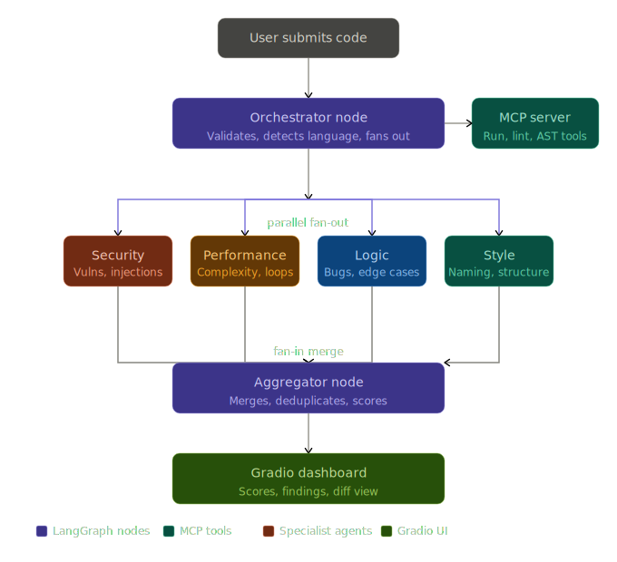

# Code Review Arena

A multi-agent code review system where **4 specialist AI agents run in parallel** to review your code simultaneously, then an aggregator merges their findings into a scored dashboard.

## Architecture: Parallel Fan-out + Aggregator



```
User Code Input
      │
      ▼
 Orchestrator  ──► MCP Server (lint, AST, language detection)
      │
      ├──► Security Agent    (vulnerabilities, injections, secrets)
      ├──► Performance Agent (complexity, loops, memory)
      ├──► Logic Agent       (bugs, edge cases, correctness)
      └──► Style Agent       (naming, structure, readability)
                │
                ▼
          Aggregator Node  (merge, deduplicate, score, summarise)
                │
                ▼
         Gradio Dashboard  (score ring, bars, issue chips, reports)
```

### Why this architecture?
The 4 reviewers are fully independent — they don't need each other's output. LangGraph's parallel node execution runs them concurrently, cutting review time roughly 4x vs sequential. The aggregator then sees all outputs at once to produce a unified report.

## Features

- **Parallel fan-out** — 4 agents review simultaneously via LangGraph
- **Custom MCP server** — lint, AST parsing, language detection, safe code execution tools
- **Weighted scoring** — Security 35%, Performance 25%, Logic 25%, Style 15%
- **Severity classification** — CRITICAL / HIGH / MEDIUM / LOW per finding
- **Session memory** — all reviews persisted to JSON for history browsing
- **Rich Gradio UI** — score ring, dimension bars, issue chips, per-agent report tabs
- **Language detection** — auto-detects Python, JS, Java, Rust, Go, and more

## Setup

```bash
# Install dependencies (is using uv, skip this)
pip install langgraph langchain-openai langchain-core mcp gradio python-dotenv pyflakes

# Configure Ollama
cp .env.example .env
# Edit .env with your model name

# Run
python app.py
OR
uv run app.py
```

## .env

```
OLLAMA_BASE_URL=http://localhost:11434/v1
OLLAMA_MODEL=qwen3:8b
REVIEW_TEMPERATURE=0.3
```

## File structure

```
Code Review Arena/
├── config.py              # Constants and env config
├── state.py               # LangGraph TypedDict state
├── mcp_server.py          # MCP tools: lint, AST, run, detect
├── graph.py               # LangGraph graph definition + engine
├── agents/
│   ├── security_agent.py
│   ├── performance_agent.py
│   ├── logic_agent.py
│   └── style_agent.py
├── app.py                 # Gradio UI
└── memory/                # Persisted session JSON files
```

Each file is focused and short — easy to extend a single agent without touching anything else.


---

### Gradio UI


