# Crime Scene Investigator

## What This Agent Does

This project implements an **adversarial AI courtroom** built on **LangGraph + MCP + Ollama**. You play the detective — submit a case brief and evidence list. Four specialist agents take over:

- a **Forensics Agent** analyses all evidence with zero bias, classifying it and reconstructing a timeline
- a **Prosecutor Agent** builds the most compelling case for guilt using that forensic report
- a **Defense Agent** reads the prosecution's argument and systematically dismantles it
- a **Judge Agent** weighs both sides independently and delivers a structured verdict with a confidence score

This is not a chatbot that opines on guilt. The agents **disagree by design**. The verdict emerges from structured adversarial reasoning — and the confidence percentage tells you how close the case actually is.

Example inputs:

- `A business partner found dead in a locked study — wife recently cut from the will`
- `A warehouse robbery where the only suspect has a partial alibi`
- `A poisoning case with three suspects and contradictory witness testimony`

---

## Why This Is A Strong Visitor-Facing Agent

- the user instantly understands the fantasy — detective submits case, agents argue it out
- the adversarial structure makes the AI reasoning **visible and surprising** — defense genuinely challenges prosecution
- the confidence score makes every verdict feel earned, not arbitrary
- the evidence board with tagged evidence types (PHYSICAL / WITNESS / DIGITAL / CIRCUMSTANTIAL) makes the case tangible
- sessions are persisted so visitors can build a case archive over time
- the noir UI aesthetic makes it feel like a real investigation room, not a dashboard

---

## Architecture Pattern

This agent uses an **Adversarial Debate + Jury Vote Architecture**.

```text
Case brief + evidence list
        |
        v
┌──────────────────────────────┐
│ Bootstrap node               │  assigns case ID, initialises state
└──────────────┬───────────────┘
               |
               v
┌──────────────────────────────┐
│ Forensics agent              │  cold, unbiased analysis
│                              │  tags evidence by type via MCP tools
│                              │  reconstructs timeline from brief
└──────────────┬───────────────┘       ┌─────────────────┐
               |─────────────────────► │   MCP server    │
               |                       │  Evidence tools │
               v                       └─────────────────┘
┌──────────────────────────────┐
│ Prosecutor agent             │  reads forensics + evidence
│                              │  builds strongest case for guilt
│                              │  (motive, opportunity, means)
└──────────────┬───────────────┘
               |
               v
┌──────────────────────────────┐
│ Defense agent                │  reads forensics + prosecution argument
│                              │  challenges every claim
│                              │  raises reasonable doubts
└──────────────┬───────────────┘
               |
               v
┌──────────────────────────────┐
│ Judge agent                  │  weighs both sides impartially
│                              │  returns structured JSON verdict:
│                              │  verdict / confidence / reasoning /
│                              │  key evidence / reasonable doubts /
│                              │  final summary statement
└──────────────┬───────────────┘
               |
               v
┌──────────────────────────────┐
│ Persist node                 │  saves case to memory/
└──────────────┬───────────────┘
               |
               v
     Gradio verdict room
  (noir UI with full case dossier)
```



### Why prosecution runs before defense

Defense reads the prosecution argument before building its own case. This mirrors real courtroom dynamics — the defense responds to specific claims rather than arguing in a vacuum. It produces sharper, more targeted rebuttals and makes the adversarial tension visible in the output.

---

## What The Visitor Actually Experiences

1. They paste a case brief — a paragraph describing the crime, scene, timeline, and suspects.
2. They list evidence items — one per line. Any format works.
3. They click **Open the Investigation**.
4. The four agents run sequentially. The UI reveals:
   - a **verdict ring** — confidence percentage and verdict label (GUILTY / NOT GUILTY / INSUFFICIENT EVIDENCE / CASE DISMISSED)
   - a **judge's closing statement** in a styled quote block
   - **key incriminating evidence** — what sealed the verdict
   - **reasonable doubts** — what almost acquitted the suspect
   - an **evidence board** — every piece of evidence tagged by type with color-coded pills
   - a **debate panel** — prosecution and defense arguments side by side
   - a **forensic science report** — the unbiased evidence analysis
5. The case is saved to the archive for later review.

---

## Key Features

| Feature | Description |
|---|---|
| **Adversarial debate architecture** | Prosecutor and Defense agents explicitly disagree. Defense reads prosecution's argument before responding |
| **Forensics-first flow** | A neutral forensics agent runs before either advocacy agent, grounding the debate in factual analysis |
| **Structured verdict JSON** | Judge returns a machine-parseable verdict with confidence score, key evidence, and reasonable doubts |
| **Evidence type classification** | MCP server tags each evidence item as PHYSICAL, WITNESS, DIGITAL, or CIRCUMSTANTIAL |
| **Timeline extraction** | MCP server parses time references from case briefs to reconstruct event sequence |
| **Contradiction detection** | MCP tool finds logical contradictions between prosecution and defense texts |
| **Session persistence** | Every case is saved to `memory/<case_id>.json` with verdict, confidence, and summary |
| **Noir UI** | Dark slate palette, amber/gold accents, italic serif title font, evidence board with color-coded tags |

---

## MCP Tools

| Tool | Purpose |
|---|---|
| `create_case` | Persists a new case with title, brief, and evidence to `memory/` |
| `tag_evidence` | Classifies each evidence item as PHYSICAL / WITNESS / DIGITAL / CIRCUMSTANTIAL |
| `extract_timeline` | Pulls time references from case text to reconstruct chronology |
| `check_contradictions` | Finds logical negation pairs between prosecution and defense arguments |
| `list_cases` | Returns all saved case IDs and titles |

---

## Verdict Confidence Scale

| Confidence | Label |
|---|---|
| 0–30 | INSUFFICIENT EVIDENCE |
| 31–54 | CASE DISMISSED |
| 55–74 | PROBABLE CAUSE |
| 75–89 | GUILTY — BEYOND REASONABLE DOUBT |
| 90–100 | GUILTY — OVERWHELMING EVIDENCE |

---

## File Structure

```
Crime Scene Investigator/
├── app.py                   # Gradio noir UI
├── graph.py                 # LangGraph adversarial debate graph + CSIEngine
├── state.py                 # CaseState TypedDict
├── config.py                # Env config, verdict label mapping
├── mcp_server.py            # MCP evidence and case file tools
├── agents/
│   ├── forensics_agent.py   # Neutral evidence analyst
│   ├── prosecutor_agent.py  # Builds case for guilt
│   ├── defense_agent.py     # Challenges prosecution, raises doubts
│   └── judge_agent.py       # Weighs debate, returns JSON verdict
└── memory/                  # Persisted case files (JSON)
```

---

## Setup

```env
OLLAMA_BASE_URL=http://localhost:11434/v1
OLLAMA_MODEL=qwen3:8b
CSI_TEMPERATURE=0.5
```

```bash
ollama pull qwen3:8b
pip install gradio langgraph langchain-openai mcp python-dotenv
python app.py
```
OR
```bash
ollama pull qwen3:8b
uv run app.py
```

Opens at `http://localhost:7862`

---

## Example Cases To Try

**The locked-room poisoning**
> Brief: Dr. Harlow was found dead at his desk at 8 PM. The door was locked from the inside. Three colleagues had access to the building that evening. The victim had recently discovered financial fraud in the department accounts.

**The warehouse heist**
> Brief: £400,000 in cash disappeared from a secure warehouse overnight. Security footage shows one vehicle entering at 2 AM — a van registered to the suspect's brother. The suspect claims he was asleep at home, alone.

**The disappearing witness**
> Brief: The only witness to a hit-and-run has recanted her testimony. She was seen speaking with the suspect's lawyer two days before changing her statement. The original statement placed the suspect's car at the scene.


---

## Gradio UI

