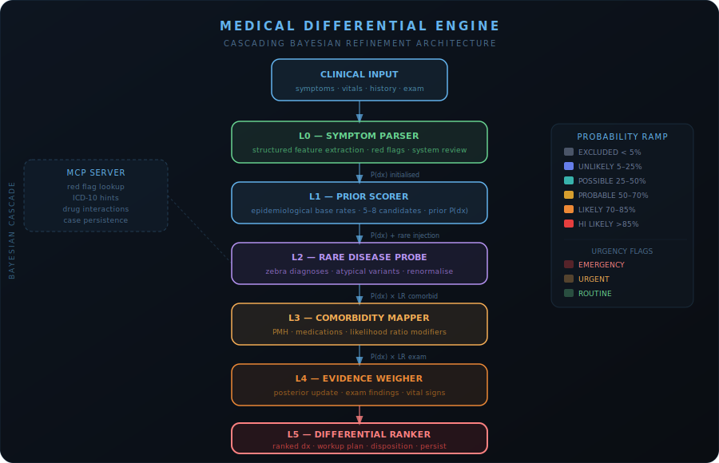

# Medical Differential Engine

> **Architecture:** Cascading Bayesian Refinement — symptoms enter as a signal and flow through five sequential specialist agents, each updating a shared probability distribution before passing it downstream. The differential collapses to a ranked, confidence-scored clinical assessment.

<p align="center">
  
</p>

---

## Architecture

```
bootstrap → symptom_parser → prior_scorer → rare_probe
         → comorbidity_mapper → evidence_weigher → ranker → persist
```

### What makes this unique

Every other agent in Evolvarium Agent Forge uses **parallel fan-out** or **sequential debate** patterns. The Medical Differential Engine uses a fundamentally different topology: **cascading Bayesian refinement**.

Each agent:
1. Receives the **full state** including all previous agents' outputs
2. Reads the **current probability distribution** over candidate diagnoses
3. **Updates** that distribution based on its specialist lens
4. Passes the updated distribution **downstream**

By the time the final ranker sees the data, probabilities have been:
- Initialised from epidemiological base rates (Prior Scorer)
- Probed for rare/atypical presentations (Rare Disease Probe)
- Modified by comorbidity likelihood ratios (Comorbidity Mapper)
- Weighted by full examination evidence (Evidence Weigher)

This is not a debate. It is a narrowing probability tree.

---

## Agent team

| Agent | Layer | Role |
|---|---|---|
| **Symptom Parser** | L0 | Converts raw clinical text into structured JSON features (onset, character, red flags, system review) |
| **Prior Scorer** | L1 | Generates initial probability distribution based on epidemiology and classic presentations |
| **Rare Disease Probe** | L2 | Injects rare/atypical "zebra" diagnoses and adjusts existing priors |
| **Comorbidity Mapper** | L3 | Applies likelihood ratio modifiers from PMH, medications, and social factors |
| **Evidence Weigher** | L4 | Updates posterior using full examination findings and vital signs |
| **Differential Ranker** | L5 | Ranks final distribution, generates workup plan, red flags, clinical summary |

---

## UI tabs

| Tab | What it shows |
|---|---|
| **🩺 Differential** | Ranked diagnosis cards with probability bars, confidence labels, supporting/against features, key tests |
| **🔬 Workup & Flags** | Disposition banner (EMERGENCY/URGENT/ROUTINE), red flag list, prioritised diagnostic workup |
| **🔄 Cascade Trace** | Row-by-row log of how each agent changed the distribution, comorbidity flags |
| **📊 Probability Evolution** | Horizontal bar chart showing how the top 6 diagnoses moved across all cascade layers |

---

## Stack

- **LangGraph** — sequential cascade graph with typed state
- **Ollama** (local) or any OpenAI-compatible endpoint
- **MCP server** — red flag lookup, ICD hints, drug interaction checker, case persistence
- **Gradio** — dark clinical UI with IBM Plex Mono + Instrument Serif typography
- **JSON persistence** — all cases saved to `memory/`

---

## Run

```bash
cd "Medical Differential Engine"
uv run app.py
# → http://localhost:7860
```

### Environment

```env
OLLAMA_BASE_URL=http://localhost:11434/v1
OLLAMA_MODEL=qwen3:8b
MDE_TEMPERATURE=0.3
```

### MCP server (standalone)

```bash
uv run mcp_server.py
```

---

## Sample cases included

1. **Chest Pain (Classic)** — 58M, crushing chest pain, ST elevation suspect
2. **Headache (Complex)** — 34F, thunderclap onset, subarachnoid suspect
3. **Dyspnoea (Subtle)** — 72F, decompensated heart failure vs PE

---

## Project structure

```
Medical Differential Engine/
├── app.py                          # Gradio UI (5 output panels)
├── graph.py                        # LangGraph cascade graph
├── state.py                        # EngineState TypedDict
├── config.py                       # Env config
├── mcp_server.py                   # MCP tools server
├── agents/
│   ├── symptom_parser_agent.py     # L0 — feature extraction
│   ├── prior_scorer_agent.py       # L1 — epidemiological priors
│   ├── rare_disease_probe_agent.py # L2 — rare/zebra injection
│   ├── comorbidity_mapper_agent.py # L3 — LR modifiers from PMH
│   ├── evidence_weigher_agent.py   # L4 — posterior from exam
│   └── differential_ranker_agent.py # L5 — final synthesis
├── ui/
│   ├── css.py                      # Dark clinical theme
│   └── html.py                     # Hero, empty, cascade HTML
└── memory/                         # Persisted cases (JSON)
```

---

## Disclaimer

This is a research tool demonstrating LangGraph agentic patterns.
It is **not** a medical device and must **never** be used for clinical decision-making.

---

## Gradio UI


